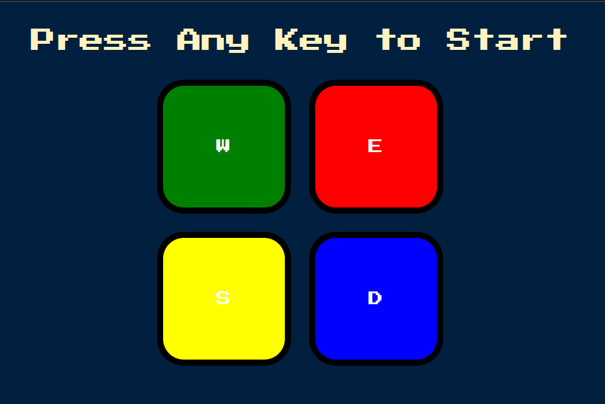

# Simon Game

A classic memory game inspired by *Simon Says*, built with HTML, CSS, and JavaScript. 
This interactive browser game tests and improves your short-term memory through color and sound sequences.

---

## Features

- Keyboard-controlled color matching (`W`, `E`, `S`, `D`)
- Sound feedback for incorrect inputs
- Visual animation effects for button presses
- Progressive difficulty with increasing levels

---

## Project Structure

```text
.
├── index.html        # Main HTML structure
├── style.css         # Visual design and styling
├── game.js           # Core game logic
└── wrong.mp3         # Audio clip for incorrect answer
```

---

## Getting Started

### 1. Clone the Repository

```bash
git clone https://github.com/your-username/simon-game.git
```

### 2. Open in Browser

You can simply open `index.html` in your preferred browser to start the game.

---

## Controls

- **W** – Green
- **E** – Red
- **S** – Yellow
- **D** – Blue

Press any key to begin. Repeat the sequence shown by the game to advance levels.

## 📸 Screenshots



